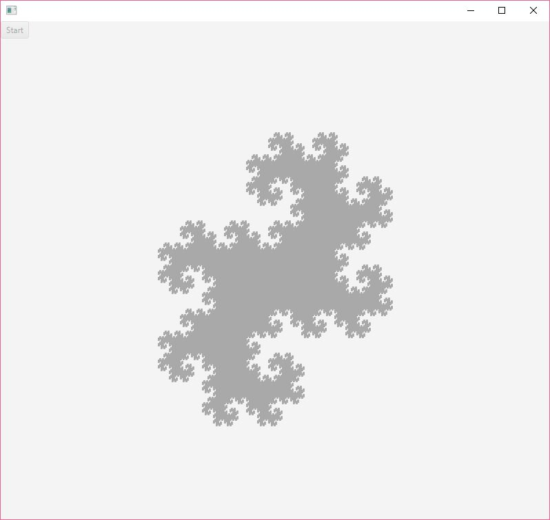

Small toy and personal project to generate a dragon curve by manipulating individual "pixels".
It is fully animated and each pixel is controller individually to generate this neat fractal.

https://en.wikipedia.org/wiki/Dragon_curve

Image example of the program, the animation is started by pressing start.

This application was created using JavaFX libraries bundled with java
